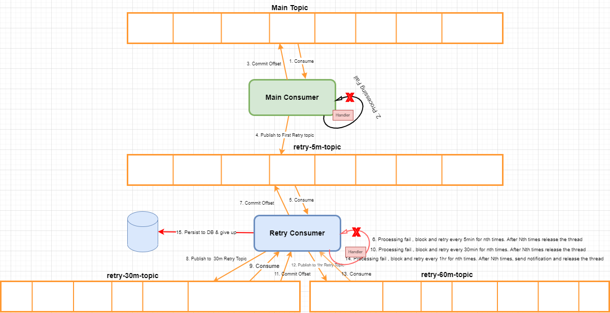

# Kafka Consumer Resiliency using Retry Topics

## Non-Blocking Retry Logic 


```bash

ImmediateConsumerRetry = Policy.HandleResult<Task>(
            res => !res.IsCompleted || res.Exception != null)
            .WaitAndRetryAsync(this.config.RetryPolicy.InitialRetryTopicName.RetryCount, retryAttempt => TimeSpan.FromMinutes(this.config.RetryPolicy.InitialRetryTopicName.WaitAfterInMins), 
            onRetry: (response, delay, retryCount, context) =>
            {
                context["retrycount"] = retryCount;
            });
        WaitForConsumerRetry = Policy.HandleResult<Task>(
            res => res.Status != TaskStatus.RanToCompletion && res.Exception != null)
          .WaitAndRetryAsync(this.config.RetryPolicy.MidRetryTopicName.RetryCount, retryAttempt => TimeSpan.FromMinutes(this.config.RetryPolicy.MidRetryTopicName.WaitAfterInMins), //retry nth times every nth minutes
            onRetry: (response, delay, retryCount, context) =>
            {
                context["retrycount"] = retryCount;
            });
        FinalWaitForConsumerRetry = Policy.HandleResult<Task>(
            res => res.Status != TaskStatus.RanToCompletion && res.Exception != null)
                .WaitAndRetryAsync(this.config.RetryPolicy.FinalRetryTopicName.RetryCount, retryAttempt => TimeSpan.FromMinutes(this.config.RetryPolicy.FinalRetryTopicName.WaitAfterInMins),
            onRetry: (response, delay, retryCount, context) =>
            {
                context["retrycount"] = retryCount;
            });
``` 

```bash Retry Config
  "RetryPolicy": {
    "InitialRetryTopicName": {
      "RetryCount": 5,
      "WaitAfterInMins": 5
    },
    "MidRetryTopicName": {
      "RetryCount": 3,
      "WaitAfterInMins": 30
    },
    "FinalRetryTopicName": {
      "RetryCount": 1,
      "WaitAfterInMins": 60
    }
  }
  ```
